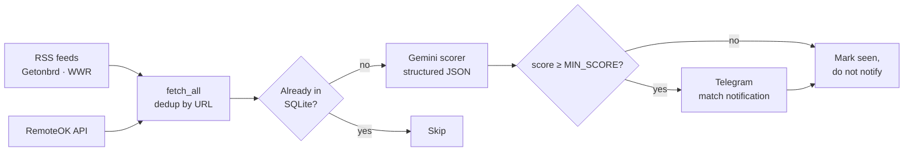

# AI Job Radar

> Personal LLM-powered job-matching radar that scans curated remote-job feeds, scores each
> posting against your CV with **Gemini**, and pushes only the strong matches to **Telegram**.
> You read, decide, and apply manually — the bot is a filter, not an auto-applier.

[](https://github.com/RobertoMena/ai-job-radar/actions/workflows/ci.yml)
[](https://github.com/RobertoMena/ai-job-radar/actions/workflows/run.yml)
[](https://www.python.org/)
[](LICENSE)

---

## Why

Searching for AI/ML roles in 2026 is signal-to-noise hell:

- Job boards refresh dozens of postings a day across categories.
- Half are mismatched seniority, wrong stack, or duplicates.
- Personalising a cover letter for irrelevant roles wastes time you should spend on real matches.

**AI Job Radar** turns that firehose into a small, daily list of high-fit opportunities,
scored by an LLM that knows *your* CV and *your* preferences.

## Architecture



The whole pipeline is one process: stateless except for `seen_jobs.db`,
which prevents re-notifying or re-scoring a job. On GitHub Actions, that DB is persisted
between runs as a workflow artifact.

## Tech stack

| Concern | Choice |
|---|---|
| Language | Python 3.10+ (typed) |
| LLM | Google Gemini (`gemini-flash-latest`) — JSON-mode |
| Sources | RSS (`feedparser`) · RemoteOK JSON API |
| Persistence | SQLite (zero-dep, ephemeral on Actions, persistent locally) |
| Notifications | Telegram Bot API (HTML formatting) |
| Scheduling | GitHub Actions cron (or Windows Task Scheduler) |
| Testing | pytest |
| Linting | ruff |

## Project layout

```
ai-job-radar/
├── ai_job_radar/
│   ├── __init__.py
│   ├── __main__.py        # python -m ai_job_radar
│   ├── cli.py             # argparse entry-point
│   ├── config.py          # Settings dataclass + dotenv
│   ├── db.py              # SeenJobsDB (SQLite)
│   ├── sources.py         # RSSSource · RemoteOKSource · fetch_all
│   ├── scorer.py          # GeminiScorer · Scoring
│   ├── notifier.py        # TelegramNotifier
│   └── pipeline.py        # run_once orchestrator
├── data/
│   ├── cv.md              # your CV in markdown (edit this)
│   └── preferences.yml    # what counts as a match (edit this)
├── tests/                 # pytest suite
├── .github/workflows/
│   ├── run.yml            # hourly cron
│   └── ci.yml             # lint + tests on push/PR
├── pyproject.toml
├── requirements.txt
├── requirements-dev.txt
├── .env.example
├── LICENSE
└── README.md
```

## Quickstart (local)

```bash
git clone https://github.com/RobertoMena/ai-job-radar
cd ai-job-radar

python -m venv .venv
source .venv/bin/activate          # Windows: .\.venv\Scripts\Activate.ps1
pip install -r requirements.txt

cp .env.example .env               # Windows: copy .env.example .env
# Fill in GEMINI_API_KEY, TELEGRAM_BOT_TOKEN, TELEGRAM_CHAT_ID

# Edit your CV and preferences:
$EDITOR data/cv.md
$EDITOR data/preferences.yml

# Smoke-test the wiring:
python -m ai_job_radar --ping       # send a test Telegram message

# Run the pipeline once:
python -m ai_job_radar              # scores + notifies
python -m ai_job_radar --dry-run    # scores only, no Telegram

# Inspect state:
python -m ai_job_radar --stats
```

### Getting credentials

| Service | How |
|---|---|
| **Gemini API key** | https://aistudio.google.com/app/apikey → "Create API key" (free tier is plenty) |
| **Telegram bot token** | Talk to [@BotFather](https://t.me/BotFather) → `/newbot` |
| **Telegram chat id** | Talk to [@userinfobot](https://t.me/userinfobot) → it replies with your numeric ID |

> ⚠️ Don't forget to send any message to your bot before running, or Telegram will block it from initiating a conversation.

## Deploy on GitHub Actions (recommended, free, zero maintenance)

1. Push this repo to your GitHub account.
2. Go to **Settings → Secrets and variables → Actions → New repository secret** and add:
   - `GEMINI_API_KEY`
   - `TELEGRAM_BOT_TOKEN`
   - `TELEGRAM_CHAT_ID`
3. (Optional) Under **Variables**, set `MIN_SCORE` (default `70`) and `MAX_JOBS_PER_RUN` (default `15`).
4. The workflow runs every hour on its own. Trigger an immediate run from the **Actions** tab → *AI Job Radar (hourly)* → *Run workflow*.

The `seen_jobs.db` is preserved between runs via a workflow artifact, so you won't get duplicate notifications.

## Configuration

| Env var | Default | Purpose |
|---|---|---|
| `GEMINI_API_KEY` | — (required) | Google AI Studio API key |
| `TELEGRAM_BOT_TOKEN` | — (required) | Bot token from @BotFather |
| `TELEGRAM_CHAT_ID` | — (required) | Numeric chat ID to send to |
| `GEMINI_MODEL` | `gemini-flash-latest` | Override the model |
| `MIN_SCORE` | `70` | Minimum score (0-100) to trigger notification |
| `MAX_JOBS_PER_RUN` | `15` | Cap per run to stay within free Gemini quota |
| `LOG_LEVEL` | `INFO` | `DEBUG`, `INFO`, `WARNING`, `ERROR` |
| `DB_PATH` | `seen_jobs.db` | SQLite file path |
| `CV_PATH` | `data/cv.md` | Path to your CV markdown |
| `PREFERENCES_PATH` | `data/preferences.yml` | Path to preferences |

## Customise it for *your* search

1. **Replace `data/cv.md`** with your own resume in markdown.
2. **Edit `data/preferences.yml`** to define what a match looks like for you:
   - `hard_preferences` — must match (drives high scores)
   - `soft_preferences` — boosts the score
   - `hard_disqualifiers` — caps the score below the threshold
3. **Add or remove sources** in `ai_job_radar/sources.py` → `DEFAULT_SOURCES`.
   Any RSS URL works.

## Sample notification

```
🔥 [88/100] AI Engineer @ Compara
Getonbrd · Machine Learning & AI

💰 USD 3000-3500/mo
🎯 Seniority: MATCH
🧠 AI focus: GENAI_LLM
🇬🇧 English: B2

Why it fits:
• Junior level matches your 3yr IT background
• LangChain & RAG explicitly mentioned
• LATAM remote, USD payment

Red flags:
• Mentions LangGraph (you use LangChain — adjacent but different)

🔗 https://www.getonbrd.com/jobs/...
```

## Development

```bash
pip install -r requirements-dev.txt

ruff check ai_job_radar tests
pytest
```

## Cost

Running every hour, scoring up to 15 jobs per run:

- ~360 Gemini requests/day → fits comfortably in the **free** tier.
- GitHub Actions: ~1500 minutes/month → fits in the **free** tier (private repo gets 2000).
- Telegram: free.

**Total: $0/month.**

## Roadmap

- [ ] Web dashboard listing scored history (Next.js + Supabase).
- [ ] Per-job draft of "Why I'm interested" cover-letter snippet, generated by Gemini.
- [ ] Embedding-based pre-filter to cut Gemini calls in half.
- [ ] More sources: Wellfound, YC Work at a Startup, Hacker News "Who is hiring".

## License

MIT — see [LICENSE](LICENSE).
